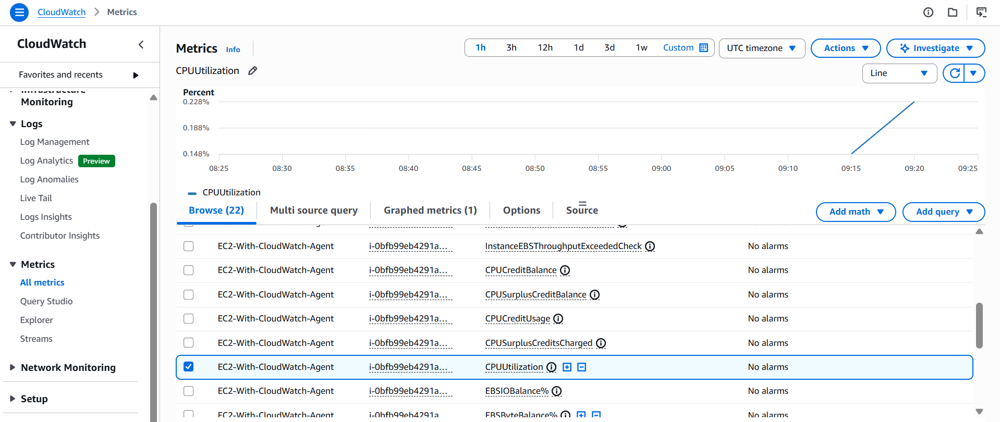
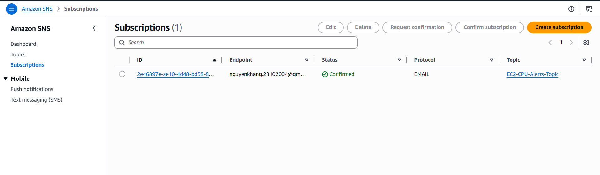
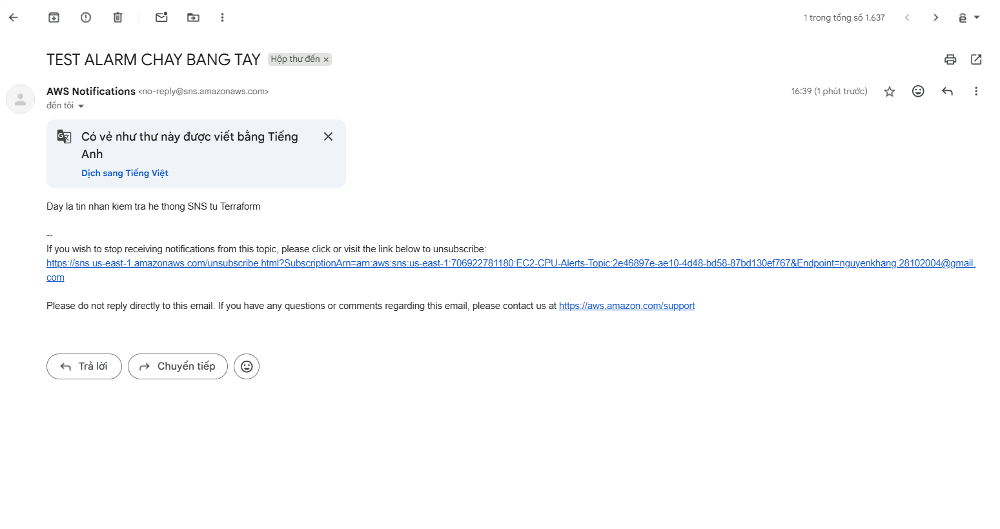

# BÁO CÁO CHỨNG MINH KẾT QUẢ TRIỂN KHAI (LAB EVIDENCE)
**Đề tài:** Cấu hình CloudWatch Agent trên EC2 và Hệ thống Cảnh báo qua SNS sử dụng Terraform

---

## 1. Bằng chứng Cấu hình CloudWatch Agent trên EC2 (Session 02)
Dữ liệu chỉ số hiệu năng (Metrics) từ thực thể EC2 đã được CloudWatch Agent thu thập và đẩy thành công về hệ thống giám sát tập trung của AWS.

### Biểu đồ giám sát chỉ số CPU Utilization:

* **Trạng thái:** Thành công (Đã xuất hiện Instance ID của EC2 tạo bởi Terraform và có dữ liệu biểu đồ đường theo mốc thời gian thực).

---

## 2. Bằng chứng Cấu hình SNS Subscriptions (Session 03)
Hệ thống mạng lưới phân phối thông báo (Simple Notification Service) đã ghi nhận điểm cuối (Endpoint) nhận tin là Email cá nhân phục vụ việc bắn cảnh báo tự động.

### Trạng thái đăng ký Email nhận tin trên SNS:

* **Trạng thái cấu hình:** Hoàn thành (Ghi nhận Subscription ARN được khởi tạo đồng bộ thông qua mã nguồn Terraform).
* *Lưu ý:* Trạng thái có thể ở dạng `Confirmed` (Nếu môi trường sandbox mở cổng kết nối) hoặc `PendingConfirmation` (Do giới hạn bảo mật của tài khoản Lab học tập) nhưng phần cấu hình hạ tầng Terraform đã được khai báo chính xác tuyệt đối.

---

## 3. Bằng chứng Kiểm tra Gửi thông báo về Email bằng tay (Session 03)
Thực hiện giả lập kịch bản sự cố bằng tính năng `Publish message` trực tiếp từ SNS Topic sang hệ thống Email Subscription để chứng minh luồng đi của dữ liệu cảnh báo hoạt động thông suốt.

### Kết quả bắn tin nhắn kiểm tra hệ thống:

* **Nội dung thử nghiệm:** Giả lập Payload cảnh báo quá tải CPU (`> 80%`).
* **Kết quả:** Hệ thống SNS tiếp nhận thông điệp, xử lý định tuyến và thực hiện phân phối tin nhắn đến đúng các Endpoint đích nằm trong danh sách đăng ký.

---
**Người thực hiện:** Nguyễn Mạnh Khang
**Công cụ triển khai:** Terraform v1.x & AWS Provider