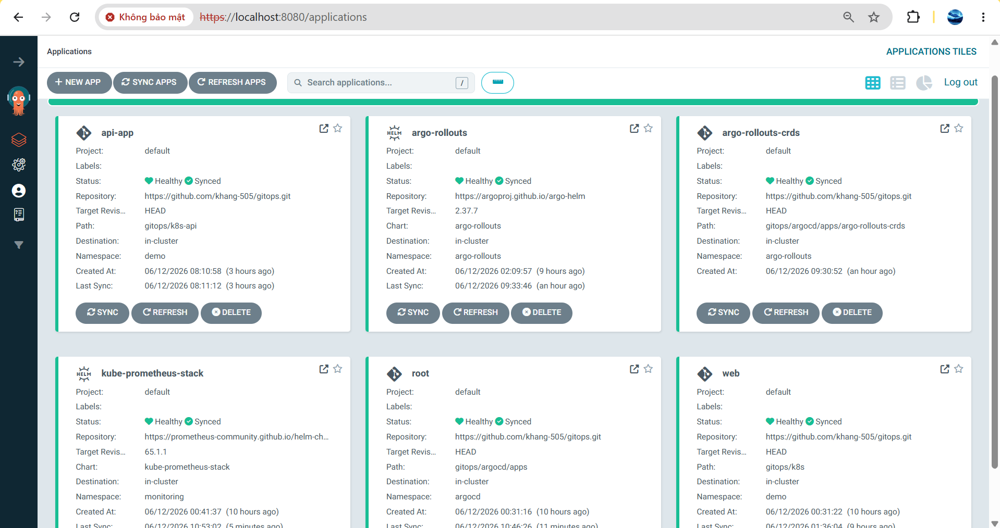
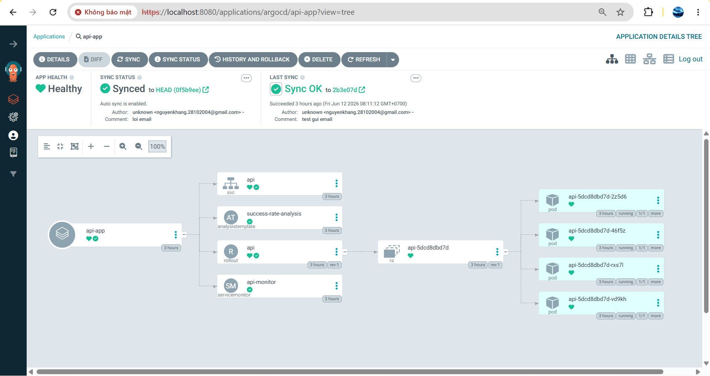
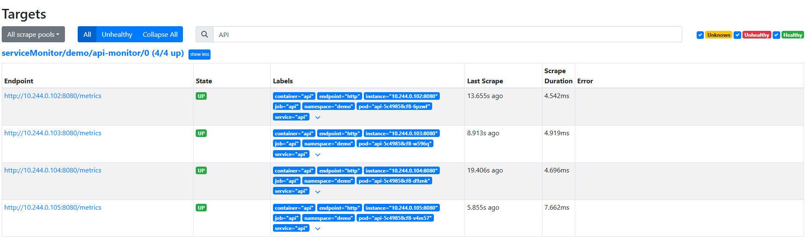
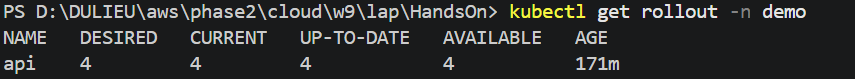
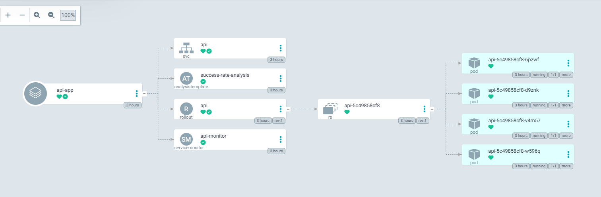
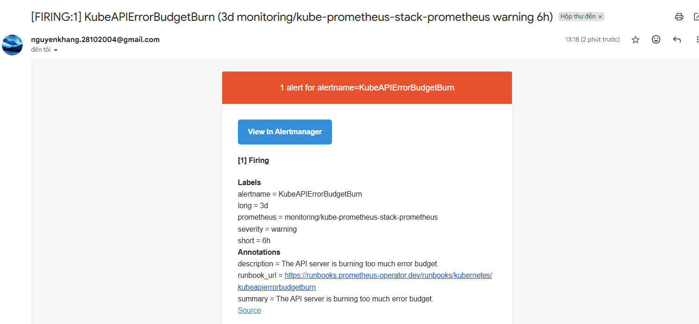
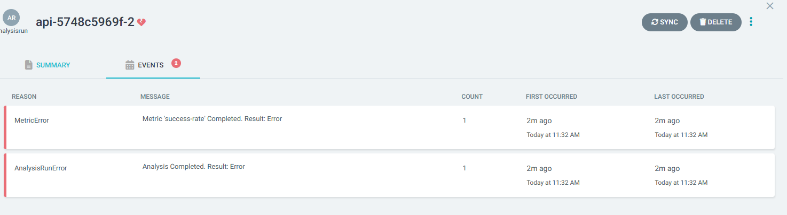
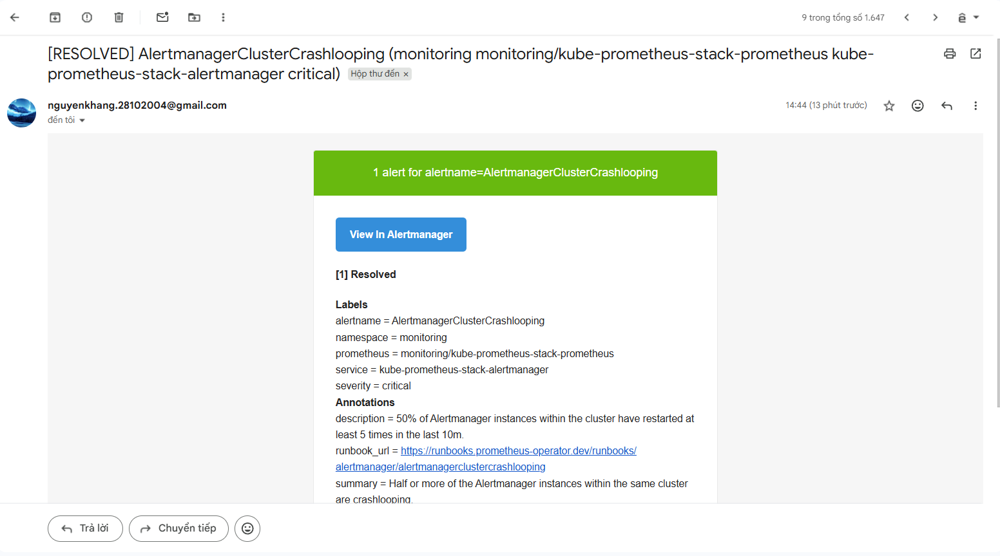

# HandsOn W9 — Observability + Canary

## Mục tiêu

Repo này chứa GitOps để:
- Cài đặt `kube-prometheus-stack` và `argo-rollouts` qua ArgoCD
- Triển khai app `api` dưới dạng `Rollout`
- Thu thập metric Prometheus bằng `ServiceMonitor`
- Giữ `Alertmanager` gửi email
- Dùng Argo Rollouts canary với `AnalysisTemplate` để tự động abort khi metric xấu

## Nội dung chính

- `gitops/argocd/apps/kube-prometheus-stack.yaml`: Cài `kube-prometheus-stack` + Alertmanager (SMTP/email)
- `gitops/argocd/apps/argo-rollouts.yaml`: Cài `argo-rollouts` controller
- `gitops/k8s-api/api.yaml`: Định nghĩa `Rollout` với canary strategy + AnalysisTemplate
- `gitops/k8s-api/servicemonitor.yaml`: Prometheus scrape `/metrics` từ API pods
- `gitops/k8s-api/analysis.yaml`: AnalysisTemplate để kiểm tra success-rate

## Các bước đã thực hiện

1. Tạo `Application` GitOps cho `kube-prometheus-stack` và `argo-rollouts`
2. Viết manifest `Rollout` cho app `api` với canary strategy
3. Tạo `ServiceMonitor` để Prometheus scrape `/metrics`
4. Dùng `ArgoCD` để sync tự động
5. Dùng `Argo Rollouts` để thả canary với auto-analysis

## Cách kiểm tra

### 1. Kiểm tra ArgoCD

```bash
kubectl -n argocd get applications
kubectl -n argocd port-forward svc/argocd-server 8080:443
# Mở https://localhost:8080 (user: admin, lấy password từ secret)
```


*Hình 1: Tất cả Applications (root, api-app, argo-rollouts, kube-prometheus-stack, web) đã Healthy + Synced*


*Hình 2: Chi tiết api-app: Rollout + AnalysisTemplate + ServiceMonitor + 4 Pods*

---

### 2. Kiểm tra Argo Rollouts Controller

```bash
kubectl get pods -n argo-rollouts
```


*Hình 3: 2 Argo Rollouts controller pods chạy trong namespace argo-rollouts*

---

### 3. Kiểm tra Prometheus

```bash
kubectl -n monitoring port-forward svc/kube-prometheus-stack-prometheus 9090:9090
# Mở http://localhost:9090
# Tab "Targets" → Tìm "api" (4 pods, tất cả UP)
# Tab "Graph" → Query: flask_http_request_total{namespace="demo"}
```


*Hình 4: 4 API pods được scrape, tất cả UP; ServiceMonitor scrape mỗi 15 giây*


*Hình 5: Query metrics flask_http_request_total; metric tăng đều đặn từ 4 pods (status=200)*

---

### 4. Kiểm tra Rollout Configuration

```bash
kubectl get rollout api -n demo -o yaml
kubectl get analysistemplate -n demo
```

### Rollout: canary strategy (mã & lý thuyết)

Đoạn trích từ `gitops/k8s-api/api.yaml` — phần `strategy.canary` (quy trình canary incremental):

```yaml
strategy:
	canary:
		analysis:
			templates:
				- templateName: success-rate-analysis
		steps:
			- setWeight: 25
			- pause: { duration: 3m }
			- setWeight: 50
			- pause: { duration: 2m }
			- setWeight: 100
```

Giải thích ngắn: Argo Rollouts sẽ dần chuyển traffic sang phiên bản mới theo trọng số (25% → 50% → 100%). Sau mỗi bước `setWeight` có `pause` để chạy `AnalysisTemplate` (nếu có) — `AnalysisTemplate` sẽ query Prometheus để đánh giá metric (ví dụ success-rate). Nếu metric không đạt điều kiện, Rollout có thể `abort` và rollback.

Xem đầy đủ manifest: [gitops/k8s-api/api.yaml](gitops/k8s-api/api.yaml#L1-L120)

### AnalysisTemplate: logic kiểm tra (mã & lý thuyết)

Đoạn trích từ `gitops/k8s-api/analysis.yaml` — `success-rate-analysis`:

```yaml
apiVersion: argoproj.io/v1alpha1
kind: AnalysisTemplate
metadata:
	name: success-rate-analysis
spec:
	metrics:
	- name: success-rate
		interval: 30s
		successCondition: result[0] >= 0.95
		failureLimit: 3
		provider:
			prometheus:
				address: http://kube-prometheus-stack-prometheus.monitoring.svc:9090
				query: |
					sum(rate(flask_http_request_total{namespace="demo", status!~"5.."}[2m]))
					/
					sum(rate(flask_http_request_total{namespace="demo"}[2m]))
```

Giải thích ngắn: Template này tính tỉ lệ request thành công (không phải 5xx) trong 2 phút gần nhất và đánh giá mỗi 30s. `successCondition` yêu cầu >= 95%; `failureLimit: 3` nghĩa là nếu kiểm tra thất bại 3 lần liên tiếp thì analysis sẽ fail — điều này kích hoạt abort/rollback của canary.

Xem đầy đủ template: [gitops/k8s-api/analysis.yaml](gitops/k8s-api/analysis.yaml#L1-L120)

---

### 5. Kiểm tra Rollout Status

```bash
kubectl get rollout api -n demo
kubectl argo rollouts get rollout api -n demo --watch
```


*Hình 8: Rollout 4/4 replicas ready, CURRENT=4, UP-TO-DATE=4, AVAILABLE=4*


*Hình 9: ArgoCD tree trước canary: Rollout + AnalysisTemplate + ServiceMonitor sẵn sàng*

*Hình 10: ArgoCD tree trước canary: Rollout + AnalysisTemplate + ServiceMonitor sẵn sàng*
---

### 6. Kiểm tra Alertmanager

```bash
kubectl -n monitoring port-forward svc/kube-prometheus-stack-alertmanager 9093:9093
# Mở http://localhost:9093
# Tab "Status" → Xem Configuration (SMTP + receivers)
# Tab "Alerts" → Xem alert rules
```


*Hình 11: Alertmanager Alerts tab; hiển thị alert rules + trạng thái*


*Hình 12: Alert Rules List; các rules đã cấu hình (severity, firing)*


*Hình 13: Email alert từ Alertmanager gửi tới nguyenkhang.28102004@gmail.com*

---

### 7. Chứng minh Canary Auto-Abort


*Hình 14: AnalysisRun fail - success-rate < 0.95; canary auto-abort sau 3 lần fail*


*Hình 15: Rollout/ArgoCD trạng thái đã resolved sau khi revert (hoặc fix)*

## Gợi ý file cần nộp

- `README.md` (tài liệu này)
- `gitops/argocd/apps/kube-prometheus-stack.yaml` (Prometheus stack + Alertmanager)
- `gitops/argocd/apps/argo-rollouts.yaml` (Argo Rollouts controller)
- `gitops/k8s-api/api.yaml` (Rollout manifest với canary strategy)
- `gitops/k8s-api/analysis.yaml` (AnalysisTemplate)
- `gitops/k8s-api/servicemonitor.yaml` (Prometheus scrape config)
- Thư mục `image/` (chứa 14 ảnh chứng minh)

## Lưu ý đặc biệt

- Image local `w9-api:1` phải load vào Minikube: `minikube image load w9-api:1 -p w9`
- `imagePullPolicy: IfNotPresent` → Kubernetes không kéo từ registry
- `ServiceMonitor` label `release: kube-prometheus-stack` phải khớp tên Prometheus
- `AnalysisTemplate` query Prometheus mỗi 30s; `failureLimit: 3` → abort sau 3 lần fail
- Email alert phụ thuộc cấu hình SMTP + mạng (cần Gmail app password)